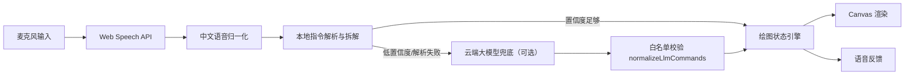

# AI 语音绘图工具设计文档

## 选题

第四批次题目二：AI 语音绘图工具。

目标是让用户不依赖鼠标或键盘，通过自然中文语音完成绘图创作。实现重点放在指令理解容错、响应延迟、复杂指令拆解，以及稳定可复现的浏览器 demo。

## 用户价值

本项目服务于“想表达画面但不想先学习复杂绘图工具”的场景：用户只需要说出自然中文，系统就把意图拆成可执行的绘图动作。它特别适合演示、课堂、无障碍交互原型和快速草图探索。

方案设计上优先保证可控性：常见指令走本地规则，避免每句话都调用云端；开放表达才进入可选 LLM 兜底，并且所有模型输出必须通过白名单校验。这样既保留自然语言的灵活性，又避免高成本、慢响应和误操作。

## 用户故事

| 用户故事 | 计划 | 实现 |
| --- | --- | --- |
| 用户可以启动语音模式并持续说绘图指令 | 是 | 是。使用 Web Speech API 连续识别，页面显示实时状态 |
| 用户可以绘制基础图形 | 是 | 是。支持圆形、矩形、三角形、线条、星星 |
| 用户可以绘制语义物体 | 是 | 是。支持太阳、山、树 |
| 用户可以指定颜色 | 是 | 是。支持红、蓝、浅蓝、绿、黄、橙、棕、紫、粉、黑、白、灰等中文颜色 |
| 用户可以指定位置 | 是 | 是。支持中间、上下左右、四个角 |
| 用户可以使用相对位置 | 是 | 是。支持在某图形左边、右边、上面、下面、前面绘制 |
| 用户可以一句话创建复杂场景 | 是 | 是。可拆解“画一个太阳，下面有两座山，山前面有一棵树” |
| 用户可以调整刚才的对象 | 是 | 是。支持变大、变小、移动、换色 |
| 用户可以删除和复制对象 | 是 | 是。支持删除刚才的对象、复制指定形状 |
| 用户可以按序号选择多个同类对象 | 是 | 是。支持第一个、第二个、第三个等匹配对象，并可叠加颜色筛选 |
| 用户可以旋转和移动到指定位置 | 是 | 是。支持旋转角度、移动到四角/边缘/中心 |
| 用户可以撤销、重做、清空 | 是 | 是 |
| 用户可以添加文字 | 是 | 是 |
| 用户可以导出图片 | 是 | 是。通过语音触发 PNG 下载 |
| 用户可以绘制参数化曲线 | 计划备选 | 是。已支持“画一条黑色波浪线” |
| 用户可以接入云端大模型做开放指令理解 | 计划备选 | 是。已落地“规则优先、低置信度才调云端”的可选兜底，默认离线 |

## 指令能力设计

计划支持的指令分为六类：

| 能力 | 示例 | 状态 |
| --- | --- | --- |
| 基础绘制 | “画一个红色圆形” | 已实现 |
| 相对布局 | “在圆形右边画一个蓝色矩形” | 已实现 |
| 复合场景 | “画一个太阳，下面有两座山，山前面有一棵树” | 已实现 |
| 对象编辑 | “把刚才的圆变大一点” | 已实现 |
| 删除复制 | “复制刚才的矩形”“删除刚才的圆” | 已实现 |
| 序号选择 | “删除第二个圆”“把第三个蓝色圆变大” | 已实现 |
| 旋转移动 | “把刚才的矩形旋转45度”“把刚才的圆移到左上角” | 已实现 |
| 画布控制 | “撤销上一步”“重做”“清空画布”“导出图片” | 已实现 |
| 文本标注 | “在左上角写上 XEngineer” | 已实现 |

## 架构



核心模块：

- `src/domain/commands.js`：归一化语音文本、识别颜色/形状/位置、拆解复合指令，输出结构化命令。
- `src/domain/demoReplay.js`：用定时器调度 `demo` 参数中的批量回放，避免后台标签页暂停 `requestAnimationFrame` 导致演示不自动执行。
- `src/domain/llmFallback.js`：统一解析入口 `resolveVoiceCommand`。规则优先，仅当本地无结果或置信度低于阈值时调用注入的云端 resolver，并用 `normalizeLlmCommands` 对开放输出做白名单校验。
- `src/llm/openaiResolver.js`：OpenAI 兼容的云端解析器工厂。密钥走 Authorization 头，`fetch` 可注入以便离线测试。
- `src/domain/drawingState.js`：维护画布状态，执行 draw、transform、undo、redo、clear、background、export 等命令。
- `src/domain/renderCanvas.js`：根据状态绘制 Canvas。
- `src/app.js`：连接浏览器语音识别、语音反馈、DOM 和 Canvas，并按 `window.__VOICE_LLM__` 配置决定是否启用云端兜底。

## 准确性与容错

已采用的策略：

- 去除常见填充词，如“请”“帮我”“麻烦”“一下”。
- 支持常见中文别名，如“圆形/圆圈/圆/园/元”“正方形/方块”“矩形/长方形”。
- 支持中文数量词，如“两座山”。
- 对复合句按“然后、接着、并且、逗号”等切分；“再”只在后面确实跟随新命令时切分，避免把“写上再见”误拆。
- 相对位置指令会寻找最近匹配的锚点图形。
- 编辑指令支持 first/last、焦点指代、颜色筛选和第 N 个匹配对象；当“这个/那个”和具体形状名同时出现时，会优先用焦点并保留形状过滤，降低同类对象较多时误操作的概率。
- 常见 ASR 错字做保守容错，如“兰色→蓝色”“桔色/橘色→橙色”。
- 对低置信移动表达做一轮澄清追问，如“整个三角形上去”“把它上去”和“把这个圆上去”会先确认是否要向上移动目标；如果点名形状当前不在画布上，则不进入澄清，避免确认一个无法执行的动作。
- 未识别指令不会改变画布，只给出语音反馈和日志。

## 响应延迟

本版默认由浏览器本地完成指令理解和绘图执行；只有配置云端密钥且本地解析失败或置信度偏低时，才会触发一次云端兜底。语音识别完成后，本地解析和状态更新通常是毫秒级，主要延迟来自浏览器语音识别本身；可选云端兜底的延迟只出现在开放表达场景。

已采用的延迟控制：

- 不上传音频或画布内容。
- 不在每次指令中调用云端 LLM。
- Canvas 只在状态变化后重绘。
- 复合指令一次解析后批量执行，减少交互轮次。

## 成本与隐私

虽然题目二没有强制要求成本控制文档，本项目仍采用低成本方案：

- 无后端服务。
- 无数据库。
- 无第三方运行时依赖。
- 默认不调用云端大模型；配置密钥后仅在本地低置信度或无结果时触发一次云端兜底。
- 不保存用户语音、文本或绘图内容。

后续若接入云端大模型，可采用“本地规则优先，低置信度才调用云端”的策略，并对上下文做短摘要，避免把完整画布历史频繁发送到云端。该策略已落地为可选兜底（`src/domain/llmFallback.js`）：默认不配置密钥即纯本地零成本运行；只有本地解析不出或置信度低时才触发一次云端调用；云端开放输出经白名单校验后才执行，密钥仅通过 Authorization 头发送、不进入 URL 或日志。

## 未完成部分与原因

| 未完成能力 | 原因 | 后续方案 |
| --- | --- | --- |
| 完整自由曲线手绘 | 语音描述连续曲线需要大量坐标或手势替代，本版先实现了参数化波浪线 | 扩展“从左到右”“振幅更大”“更密”等参数 |
| 开放世界图像生成 | 需要云端模型生成位图，成本和稳定性不可控 | 已先以“低置信度兜底到 OpenAI 兼容接口、映射到最接近图元”的方式落地，后续再评估接图像生成 |
| 对象命名 | 当前已支持 first/last、焦点指代、颜色筛选、“第 N 个匹配对象”和一轮澄清追问，但还不能给对象起名 | 后续增加对象命名反馈，如“把这个叫小太阳” |
| 多轮精确澄清 | 当前只支持一轮确认式澄清，不做多候选、多轮选择；相对绘制后的连续“它”仍优先沿用关系锚点焦点 | 后续引入更完整的澄清状态机 |

## 验证方式

自动化测试：

```bash
npm test
```

本地演示：

```bash
npm run serve
```

浏览器打开 [http://localhost:4173/](http://localhost:4173/)，允许麦克风后按 README 的 demo 流程演示。自动化或无麦克风环境可打开 [http://localhost:4173/?replay=1](http://localhost:4173/?replay=1) 验证同一套解析与绘图执行链路。录制或评审复现时也可以使用 `demo` 参数批量回放，例如 `?replay=1&demo=画一条黑色波浪线|画一个蓝色矩形|复制刚才的矩形`。

在线部署地址为 [https://wyb123465.github.io/ai-voice-drawing-tool/](https://wyb123465.github.io/ai-voice-drawing-tool/)。推送到 `main` 后，GitHub Pages Actions 会运行测试并发布静态站点。

不配置密钥演示云端兜底链路：`?replay=1&llmdemo=1` 启用本地模拟响应（不发网络请求），输入“画一只猫”等开放表达即可看到“低置信度 → 兜底 → 白名单校验 → 绘制”全程，日志标注“云端·模拟”。

## 提交材料

提交入口、部署入口、文本回放链接、录屏脚本和提交前检查清单集中维护在 [docs/submission.md](./submission.md)。GitHub Pages 首次部署前需要在仓库设置中启用 Pages，并选择 GitHub Actions 作为 Source。
